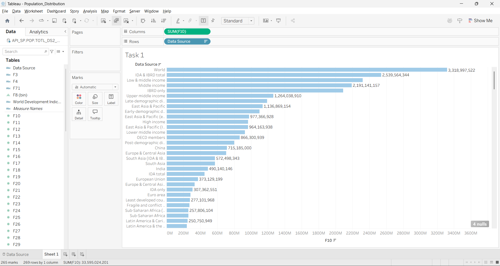

# PRODIGY_DS_01

## Task
Create a bar chart or histogram to visualize the distribution of a categorical or continuous variable.

## Dataset
World Bank Population Dataset

## Tool Used
- Tableau
- GitHub

## Visualization
- Bar Chart showing population distribution by country

## Output Screenshot

## Author
Subham
